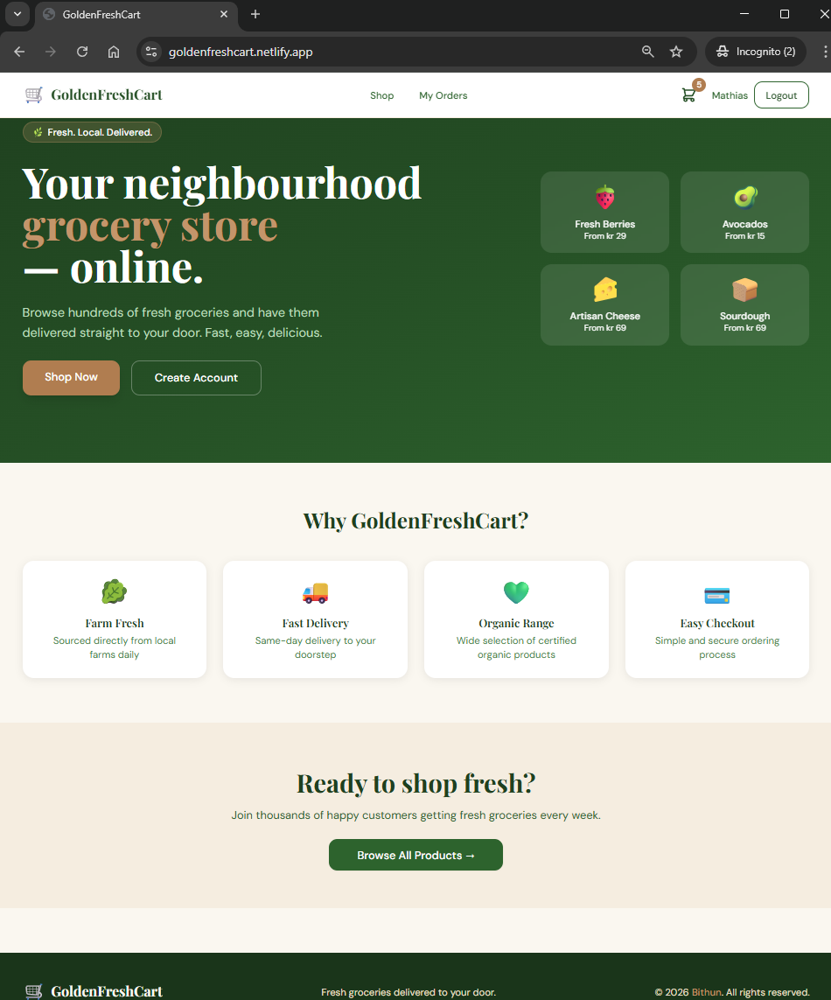
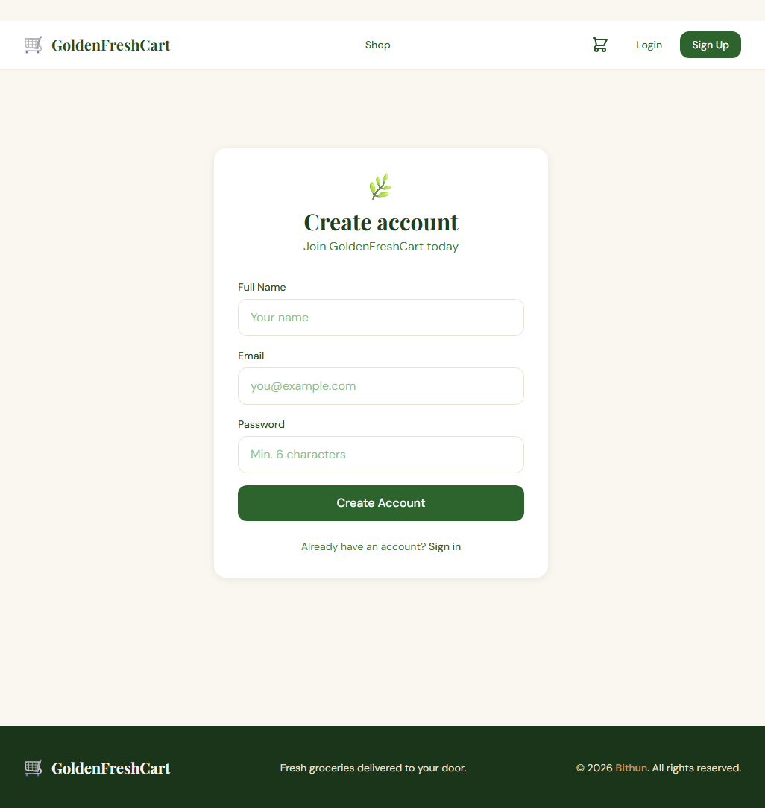
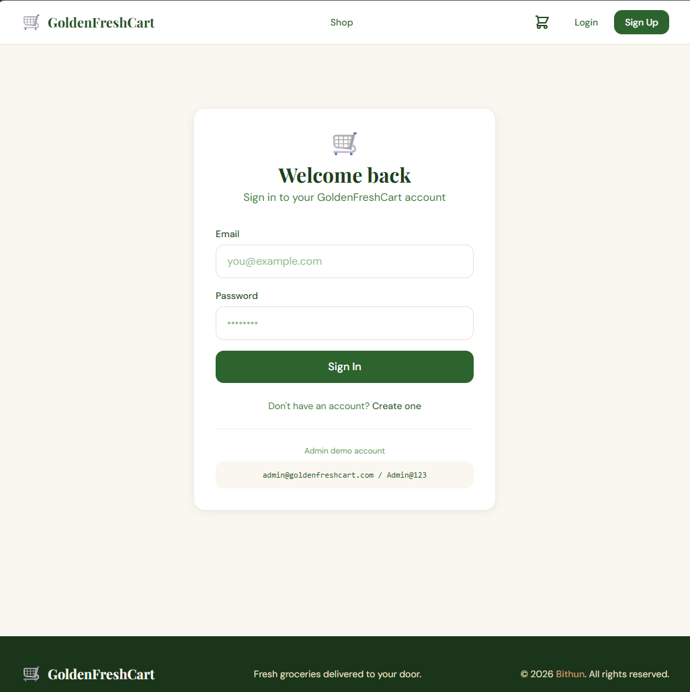
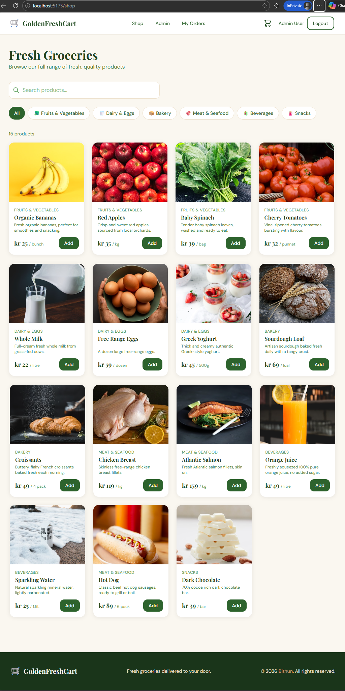
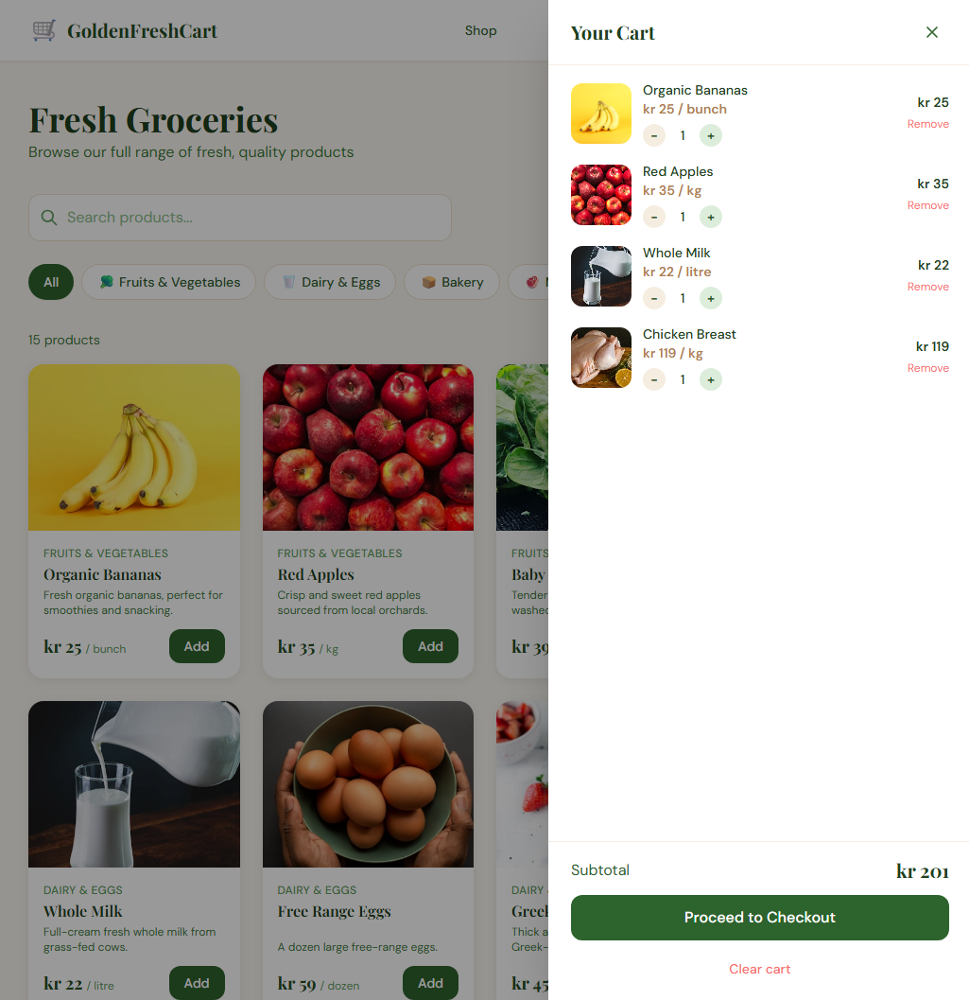
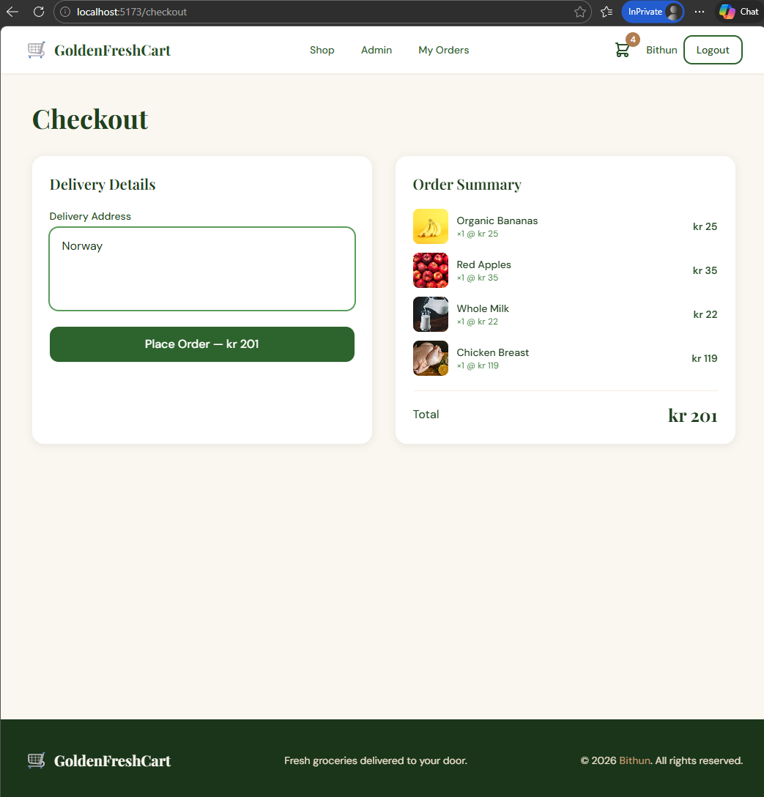
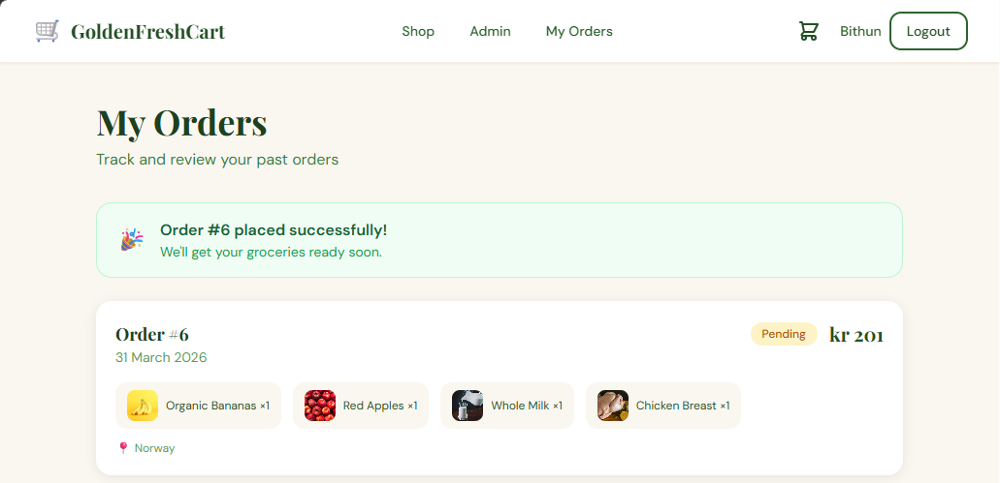
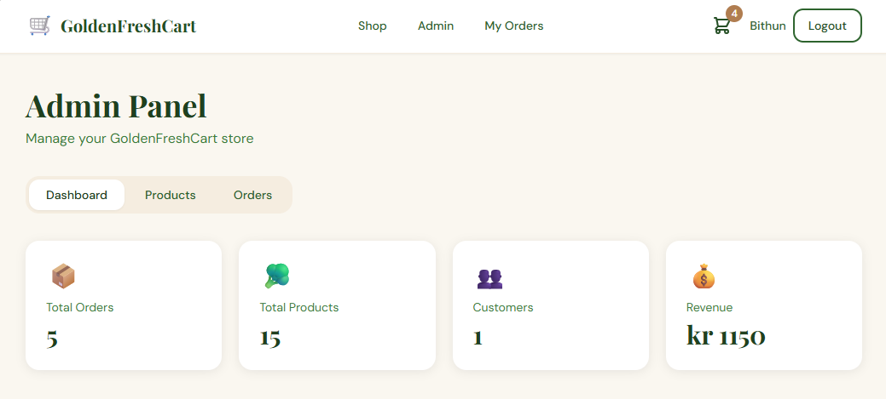
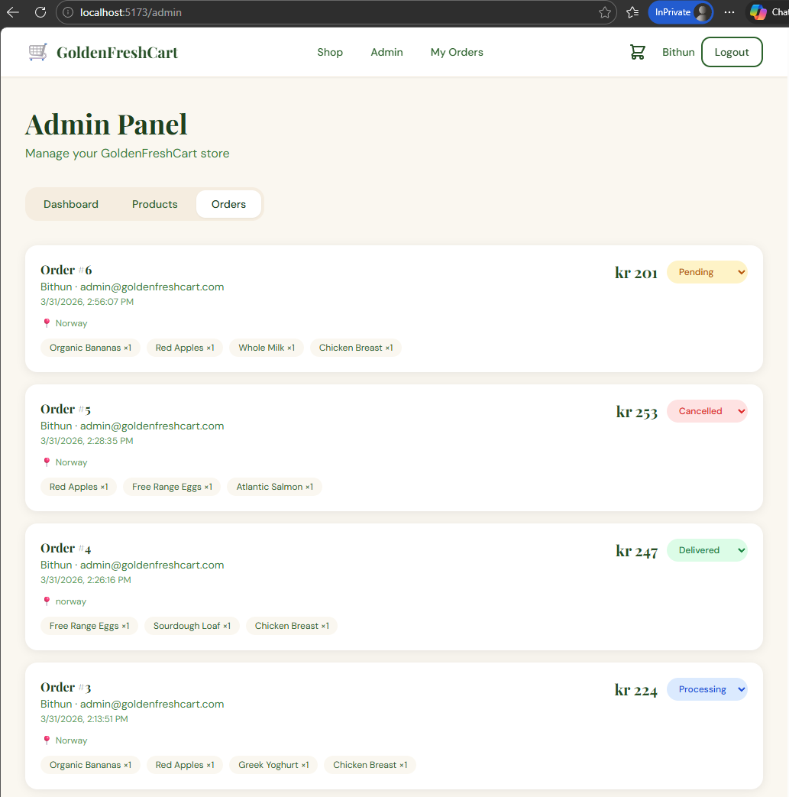

# 🛒 GoldenFreshCart

**A fully functional, production-grade Norwegian grocery store web application** built with a modern full-stack architecture. Features a complete shopping experience from product browsing to order placement, backed by a secure REST API with role-based authentication.

---

<div align="center">
  <video src="https://github.com/user-attachments/assets/d2ec1712-9a40-4059-918f-c428d90129ec" width="100%" controls autoplay loop muted></video>
</div>

## ✨ Features

### 🛍️ Customer Experience
- Browse and search products by category
- Add to cart with real-time sidebar updates
- Secure checkout and order placement
- View full order history and status

### 🔐 Authentication & Security
- JWT-based authentication with protected routes
- Role-based access control (Customer / Admin)
- Secure registration and login system

### 🛠️ Admin Panel
- Dashboard with live stats (orders, revenue, users, products)
- Add, edit, delete products (with image, stock, availability)
- View all customer orders
- Update order status (Pending → Processing → Delivered)

### 💰 Localized for Norway
- Prices displayed in Norwegian Krone (kr)
- Clean, whole-number price formatting

---

## 🧰 Tech Stack

| Layer      | Technology                              |
|------------|-----------------------------------------|
| Frontend   | React 19, TypeScript, Vite, Tailwind CSS |
| Backend    | ASP.NET Core 10 Web API                 |
| Database   | SQLite via Entity Framework Core        |
| Auth       | JWT Bearer Tokens                       |
| State      | Zustand                                 |

---

## 🚀 Getting Started

### Prerequisites
- [.NET 10 SDK](https://dotnet.microsoft.com/download)
- [Node.js 20+](https://nodejs.org/)

Install EF Core CLI tools:
```bash
dotnet tool install --global dotnet-ef
```

> On Windows, if `dotnet-ef` is not found after install, reopen your terminal or use the full path: `~/.dotnet/tools/dotnet-ef`

---

### Backend

```bash
cd backend/GoldenFreshCart.API

# Restore packages
dotnet restore

# Create and seed the database
dotnet-ef migrations add InitialCreate
dotnet-ef database update

# Run the API (http://localhost:5000)
dotnet run
```

> The database is also auto-created on first `dotnet run` if migrations already exist.

### Frontend

```bash
cd frontend

# Install dependencies
npm install

# Start dev server (http://localhost:5173)
npm run dev
```

### Open the app

Visit: **http://localhost:5173**

Both terminals must stay running at the same time.


### Accounts

| Role | Email | Password |
|------|-------|----------|
| Admin | admin@goldenfreshcart.com | Admin@123 |
| Customer | Register via /register | — |

---

## 📸 Screenshots

🧩 **Landing page**



🧩 **Sign-up page**



🧩 **Login page**



🧩 **All Products Page**



🧩 **Cart**



🧩 **Checkout Page**



🧩 **Order Page**



🧩 **Admin Panel Dashboard**



🧩 **Admin Panel Orders**



---

## 📁 Project Structure

```
golden.grocery.cart/
├── netlify.toml              # Netlify build config (base, command, publish dir)
├── backend/
│   └── GoldenFreshCart.API/
│       ├── Controllers/      # Auth, Products, Categories, Orders
│       ├── Data/             # AppDbContext + seed data
│       ├── DTOs/             # Request/response models
│       ├── Models/           # Entity models
│       ├── Services/         # JWT token service
│       ├── Program.cs
│       └── appsettings.json
└── frontend/
    ├── public/
    │   └── _redirects        # Netlify SPA redirect rule for React Router
    ├── .env.development      # Local dev API URL (not committed to git)
    ├── .env.production       # Production Railway API URL (not committed to git)
    └── src/
        ├── api/              # Fetch wrappers for all endpoints
        ├── components/       # Navbar, Footer, CartSidebar, ProductCard
        ├── pages/            # Home, Shop, Login, Register, Checkout, Orders, Admin
        ├── store/            # Zustand auth + cart stores
        └── types/            # TypeScript interfaces
```

---

## Author

**Bithun** — Senior Technical Consultant

---

## License

This project is licensed under the [MIT License](LICENSE).

© 2026 [Bithun](https://github.com/goldenbutter). All rights reserved.
